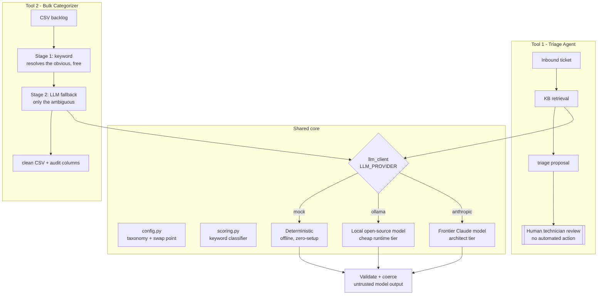

# Help Desk AI Toolkit

Two LLM-powered tools for an IT help desk, built on a shared classification core:

1. **Triage Agent** — reads an inbound ticket, retrieves knowledge base context, and
   proposes a category, priority, the information a technician still needs, and a draft
   Tier-1 reply. A proposal for human review — never an automated action.
2. **Bulk Categorizer** — a portable utility that cleans up a backlog of mis-categorized
   tickets with a two-stage keyword-then-LLM pipeline.

They're separate tools with separate entry points and separate jobs. They share one
taxonomy, one keyword classifier, and one model client — which is exactly the
relationship they had in production, where the categorizer established the category
taxonomy that the triage agent then built on.

The design choice tying it all together is a **hybrid model architecture exposed as a
single config boundary**: a frontier model can design and supervise, while a local
open-source model handles routine, high-volume inference cheaply and with no ticket data
leaving the building. Which one runs is one environment variable.

> Self-contained and runnable with zero setup. All data is synthetic — there is no
> resemblance to any real organization or ticket data.

---

## Shared architecture

Both tools sit on the same foundation. `config.py` holds the taxonomy and the provider
swap; `scoring.py` is the deterministic keyword classifier used by both; `llm_client.py`
exposes one interface over three interchangeable backends.



**`config.py` is the swap point** — set `LLM_PROVIDER` and every model call in both tools
moves between tiers without touching any other code.

### Why hybrid — the cost & privacy thesis

- **Cost scales with difficulty, not volume.** Routine, high-confidence tickets are
  resolved by a deterministic/keyword pass or a cheap local model. Only genuinely
  ambiguous cases need a frontier model. In the bundled demo, the keyword stage alone
  resolves ~85% of a 300-ticket backlog before any model is called.
- **Data privacy by default.** Point `LLM_PROVIDER` at a local model and no ticket text
  — which routinely contains names, asset tags, and account details — ever leaves your
  infrastructure. The frontier tier is opt-in, for the work that genuinely benefits from it.
- **Frontier as architect, local as runtime.** A frontier model is ideal for design,
  prompt engineering, and supervising edge cases; a small local model is ideal for the
  thousand routine inferences a day. Making the boundary a single config line means you
  choose per-deployment, not per-rewrite.

### Security posture (carried over from the production design)

- **Human-in-the-loop is mandatory.** The triage agent only ever produces a proposal; it
  never creates, edits, or closes a ticket.
- **Model output is untrusted data.** Every model response passes through a validation /
  coercion layer (`LLMClient._clean_triage`) before use — the category is allowlisted,
  the priority is constrained, confidence is clamped.

---

## Tool 1 — Triage Agent

**The problem.** Inbound tickets arrive with wildly uneven detail. Technicians spend
their first contact gathering basics — device, error message, what the user already tried
— before any real work starts. Categorization and priority are applied inconsistently at
intake, making routing, reporting, and trend analysis unreliable.

**What it does.** Standardizes first contact: every ticket arrives pre-classified,
pre-enriched with KB context, and accompanied by a drafted reply and a short list of the
exact questions a technician needs answered — while keeping a human firmly in the loop.

```bash
python triage_agent.py --demo 3
python triage_agent.py --text "VPN keeps dropping and I can't work"
python triage_agent.py --ticket TS-1004
```

---

## Tool 2 — Bulk Categorizer

**The problem.** Over time, a large share of historical tickets end up under wrong,
missing, or placeholder categories. The category field — the one used for reporting and
routing — becomes unreliable, and fixing it by hand across thousands of tickets isn't a
practical use of technician time.

**What it does.** Reads a CSV of tickets and assigns a clean category to each via two
stages: a free offline keyword pass resolves the obvious tickets, and only the ambiguous
ones are sent to a model. A `--dry-run` mode shows what would change before writing.

```bash
python bulk_categorize.py --dry-run
python bulk_categorize.py --out data/tickets_categorized.csv
```

---

## Quickstart

No dependencies are needed for the default (mock) provider — just Python 3.9+.

```bash
# 1. Generate the synthetic tickets + mock knowledge base
python data/generate_synthetic.py

# 2. Run either tool (see the two sections above)
python triage_agent.py --demo 3
python bulk_categorize.py --dry-run
```

See [`examples/sample_run.txt`](examples/sample_run.txt) for expected output.

### Switching providers (the hybrid swap)

```bash
# Default — deterministic, offline, no setup
set LLM_PROVIDER=mock           # (PowerShell: $env:LLM_PROVIDER="mock")

# Local open-source model via Ollama — install Ollama, then `ollama pull llama3.1:8b`
set LLM_PROVIDER=ollama

# Frontier Claude model — pip install -r requirements.txt, set ANTHROPIC_API_KEY
set LLM_PROVIDER=anthropic
```

Nothing else changes. Copy `.env.example` to `.env` to set these persistently.

---

## Repo layout

```
helpdesk-triage-agent/
├── README.md
├── requirements.txt          # only needed for the anthropic provider
├── .env.example              # the LLM_PROVIDER swap point
│
│   # --- shared core (both tools) ---
├── config.py                 # providers, taxonomy, paths
├── scoring.py                # deterministic keyword classifier
├── llm_client.py             # mock / ollama / anthropic behind one interface
├── prompts/                  # prompt templates used by the real providers
│
│   # --- the two tools ---
├── triage_agent.py           # Tool 1: retrieve KB -> propose -> human review
├── bulk_categorize.py        # Tool 2: two-stage CSV backlog categorizer
│
├── data/
│   ├── generate_synthetic.py # builds tickets.csv + kb/
│   ├── tickets.csv           # ~300 synthetic tickets (generated)
│   └── kb/                   # one mock KB article per category (generated)
└── examples/
    └── sample_run.txt
```

---

## Notes

- **Synthetic only.** `data/generate_synthetic.py` is seeded, so the data is reproducible.
  The ground-truth column (`_seed_category`) exists only so the demo can report accuracy.
- **Mock provider is a real implementation of the interface**, not a stub — it classifies
  with the shared keyword scorer and produces valid, structured proposals. That is what
  lets both tools run with zero setup while still exercising the real control flow.
- The triage taxonomy and keyword cues live in `config.py`; edit them there to retarget
  the toolkit to a different environment.
