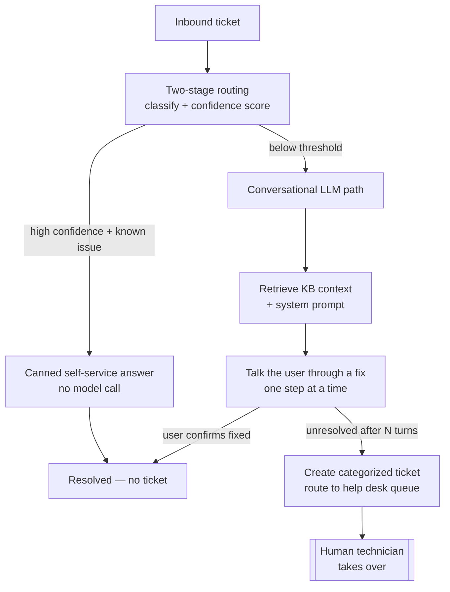

# Help Desk AI Toolkit

Two LLM-powered tools for an IT help desk, built on a shared classification core:

1. **Tier-1 Support Agent** — an autonomous agent that takes an inbound ticket, tries to
   resolve it *with the user* through a short troubleshooting conversation, and escalates
   to a human technician (with a categorized ticket) only when it can't.
2. **Bulk Categorizer** — a portable utility that cleans up a backlog of mis-categorized
   tickets with a two-stage keyword-then-LLM pipeline.

They're separate tools with separate entry points, sharing one taxonomy, one keyword
classifier, and one model client.

The design choice tying it together is a **hybrid model architecture exposed as a single
config boundary**: a frontier model for hard reasoning, a local open-source model for
routine high-volume work, and a deterministic offline default — chosen by one environment
variable.

> Self-contained and runnable with zero setup. All data is synthetic — there is no
> resemblance to any real organization or ticket data.

---

## Tool 1 — Tier-1 Support Agent

The agent's whole point is to **deflect routine tickets by actually resolving them**, and
to escalate cleanly when it can't. The pipeline:



**Why it's built this way:**
- **Cost scales with difficulty, not volume.** Routine tickets are resolved by a keyword
  pass with a canned, KB-backed answer — *zero model calls*. Only the harder ones enter
  the conversational path. In a real backlog the cheap path handles the large majority.
- **The conversation is bounded.** The agent works the issue for a few turns, then escalates
  rather than looping forever — and the escalated ticket carries the category, priority, and
  the full transcript so the technician starts with context, not a blank page.
- **Data privacy by default.** Point `LLM_PROVIDER` at a local model and ticket text — names,
  asset tags, account details — never leaves your infrastructure. The frontier tier is opt-in.

```bash
python support_agent.py --demo                 # scripted scenarios, no input needed
python support_agent.py --chat                 # type a ticket and play the end user
python support_agent.py --text "VPN keeps dropping and I can't connect"
python support_agent.py --ticket TS-1004
```

The `--demo` run shows all three outcomes back to back: a **canned** self-service resolution
(no model call), a problem **resolved through conversation**, and one **escalated** to a
technician with a ticket written to `data/queue/`. See
[`examples/sample_run.txt`](examples/sample_run.txt).

---

## Tool 2 — Bulk Categorizer

Reads a CSV of tickets with unreliable categories and assigns a clean one to each via two
stages: a free offline keyword pass resolves the obvious tickets, and only the ambiguous
ones are sent to a model. `--dry-run` shows what would change before writing.

```bash
python bulk_categorize.py --dry-run
python bulk_categorize.py --out data/tickets_categorized.csv
```

---

## The hybrid swap (shared by both tools)

`config.py` is the swap point. Both tools call one model client (`llm_client.py`) that
exposes the same two methods over three interchangeable backends. Set `LLM_PROVIDER` and
every model call moves between tiers — no other code changes.

| Provider | What it is |
|---|---|
| `mock` (default) | Deterministic, offline, zero-setup. A real implementation of the interface, not a stub — it runs the full routing + conversation + escalation logic so the whole pipeline works with no model installed. |
| `ollama` | A local open-source model over HTTP — the cheap runtime tier; ticket data stays in your infrastructure. |
| `anthropic` | A frontier Claude model — the "architect" tier, for the genuinely hard cases. |

```bash
set LLM_PROVIDER=mock        # (PowerShell: $env:LLM_PROVIDER="mock")
set LLM_PROVIDER=ollama      # after: ollama pull llama3.1:8b
set LLM_PROVIDER=anthropic   # after: pip install -r requirements.txt + ANTHROPIC_API_KEY
```

### Security posture
- **Bounded autonomy.** The agent's actions are limited to talking to the user and creating
  an intake ticket; it escalates anything it can't resolve. It doesn't take destructive or
  privileged actions.
- **Model output is untrusted data.** Every model turn passes through a validation layer
  (`LLMClient._clean_turn`) that constrains the status to a known set and guards the message
  before the agent loop acts on it.

---

## Quickstart

No dependencies for the default (mock) provider — just Python 3.9+.

```bash
python data/generate_synthetic.py     # build synthetic tickets + mock KB
python support_agent.py --demo        # watch the agent resolve and escalate
python bulk_categorize.py --dry-run   # preview a backlog cleanup
```

---

## Repo layout

```
helpdesk-ai-toolkit/
├── README.md
├── requirements.txt          # only needed for the anthropic provider
├── .env.example              # the LLM_PROVIDER swap point
│
│   # --- shared core ---
├── config.py                 # providers, taxonomy, routing thresholds, canned answers
├── scoring.py                # deterministic keyword classifier
├── llm_client.py             # mock / ollama / anthropic behind one interface
├── prompts/                  # system prompts used by the real providers
│
│   # --- the two tools ---
├── support_agent.py          # Tool 1: route -> resolve with user -> or escalate
├── bulk_categorize.py        # Tool 2: two-stage CSV backlog categorizer
│
├── data/
│   ├── generate_synthetic.py # builds tickets.csv + kb/
│   ├── tickets.csv           # ~300 synthetic tickets (generated)
│   ├── kb/                   # one mock KB article per category (generated)
│   └── queue/                # escalated tickets written at runtime (gitignored)
└── examples/
    └── sample_run.txt
```

---

## Status & roadmap

This is a clean-room reference implementation of a system I built and run in a production IT
environment. What's here reflects the real architecture; a few pieces are deliberately
modeled rather than fully built out:

- **Knowledge-base retrieval** is keyword-based here (and is the part still being refined in
  the production version). The natural next step is semantic retrieval (embeddings + a vector
  store) instead of keyword matching.
- **Intake is from text/CSV**; in production the front door is email.
- **Planned next:** directory/identity lookup (e.g. MS Graph) so the agent can resolve who the
  user is and tailor responses, and a self-hosted local model on dedicated hardware to run the
  whole pipeline on-prem.

All data here is synthetic and seeded, so results are reproducible. The mock provider exercises
the real control flow end to end, which is what lets the repo run with zero setup.
